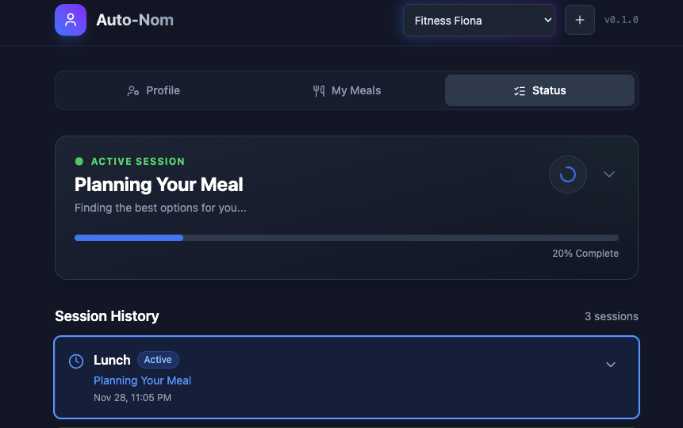
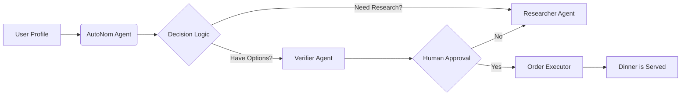

# Auto Nom 🤖🍲
> **Autonomous Meal Orchestration with Human-in-the-Loop Control.**

**Auto Nom** (short for auto nom nom nom nom) is a next-generation "Concierge Agent" that uses agentic AI to proactively manage, plan, and order your meals.

Built for the **Google AI Intensive Capstone (December 2025)**, this project demonstrates advanced patterns in multi-agent orchestration, state management, and semantic reasoning using the Google Agent Development Kit (ADK).

## 📸 Demo & Architecture

### AutoNom Architecture


### Agentic Workflow


### App Screenshots



## 💡 What is Auto Nom?

Traditional food apps require you to search, filter, and scroll. **Auto Nom** reverses this paradigm. It works *for* you, not *with* you.

Based on your schedule, mood, allergies, and dietary goals, Auto Nom proactively:
1.  **Analyzes** your deep context (e.g., "I need a warm hug in a bowl because it's raining").
2.  **Researches** live options via **DashDoor** (our custom microservice API).
3.  **Proposes** the perfect set of meals.
4.  **Waits** for your final "nod" of approval (Human-in-the-Loop).
5.  **Executes** the order and handles the transaction logic.

## 🏗️ Architecture & Tech Stack

This project is not just a script; it is a full-stack agentic platform designed with production-grade patterns.

### The Stack
* **Orchestrator:** Python (Google ADK) + FastAPI (Async).
* **Frontend:** React + Vite + Tailwind CSS (Modern Dashboard).
* **Data Layer:** SQLite with WAL mode (Persistent State Machine).
* **Infrastructure:** Docker Compose (Microservices Architecture).

### Core Concepts Demonstrated
* **HUB-AND-SPOKE AGENTS:** A central `AutoNom` orchestrator delegates tasks to specialized workers (`MealChoiceGenerator`, `MealChoiceVerifier`, `MealOrderExecutor`).
* **DETERMINISTIC STATE MACHINE:** Prevents LLM loops by enforcing strict state transitions (`PLANNING` -> `AWAITING_APPROVAL` -> `ORDERING`) stored in a persistent database.
* **MICROSERVICE TOOL USE:** Agents interact with **DashDoor**, a standalone mock restaurant API running in a separate container, simulating real-world API integration and network latency.
* **HUMAN-IN-THE-LOOP (HITL):** The system is designed to pause execution for critical financial decisions, resuming seamlessly once the user approves via the UI.
* **OBSERVABILITY:** The frontend receives a live "Thought Stream" (Server-Sent Events) showing the agent's internal reasoning, tool calls, and decision-making process in real-time.

## 🚀 How to Run Locally

This project is containerized for easy deployment. You need **Docker Desktop** installed.

### 1. Clone the Repository

```bash
git clone [https://github.com/gaurangdave/AutoNom](https://github.com/gaurangdave/AutoNom)
cd autonom
```

### 2. Configure Environment
Create a .env file in the root directory:

```bash
GOOGLE_API_KEY=your_gemini_api_key_here
# TELEGRAM_BOT_TOKEN=optional_if_using_telegram
```
### 3. Launch the System
Run the entire stack (Agent + Database + UI + DashDoor API) with one command:

```bash
docker-compose up --build
```

### 4. Access the Dashboard
* Agent Dashboard: Open http://localhost:8000
* DashDoor API Docs: Open http://localhost:8001/docs

## 🧪 Demo Scenarios
The app comes pre-loaded with "Persona Profiles" to test specific agent capabilities:

* Cozy Chris (Contextual Reasoning): "It's raining, I want a warm hug in a bowl." (Tests semantic mapping of mood -> food).

* Fitness Fiona (Hard Constraints): "High protein, under 600 calories, under $20." (Tests mathematical filtering and reasoning).

* Tech Lead Tina (Agency): "Order a bundle for 10 people, half vegan, $150 budget." (Tests complex bundling and autonomy).

## 🚀 About Me

A jack of all trades in software engineering, with 15 years of crafting full-stack solutions, scalable architectures, and pixel-perfect designs. Now expanding my horizons into AI/ML, blending experience with curiosity to build the future of tech—one model at a time.

## 🔗 Links

[](https://gaurangdave.me/)
[](https://www.linkedin.com/in/gaurangvdave/)

## 🛠 Skills
`Google ADK`, `Agentic AI`, `Python`, `FastAPI`, `React`, `Docker`, `Microservices`

